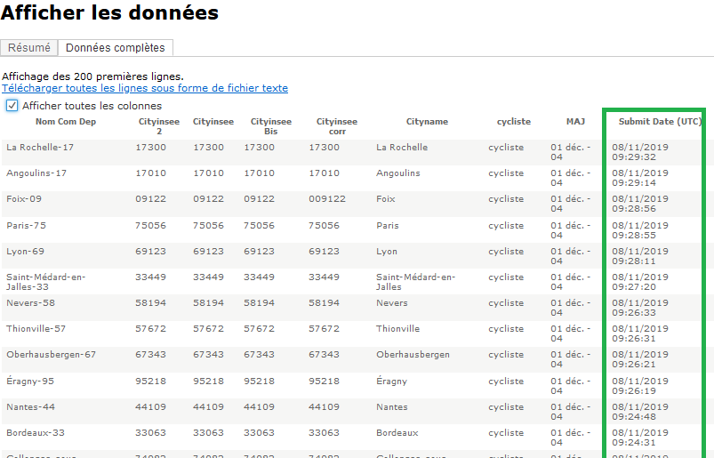

<style>
body {
text-align: justify}
</style>

```{r setup, include=FALSE}
knitr::opts_chunk$set(echo = FALSE, warning = FALSE, error = FALSE, message = FALSE)
```

Depuis 2017, la [Fédération des Usagers de la Bicyclette (FUB)](www.fub.fr) organise une enquête nationale sur l'expérience des usagers du vélo en ville, le [**Baromètre des villes cyclables**](https://barometre.parlons-velo.fr). Cette enquête est parmi les plus importantes au monde sur ce thème, et recueille le point de vue d'usagers sur différents aspects de leur expérience : sentiment de sécurité, qualité des aménagements, écoute de la mairie, disponibilité de vélos en location de courte durée ou de stationnement sécurisé, etc. J'aimerais m'intéresser ici non pas au contenu des évaluations laissées par les cyclistes mais à la dynamique de ce type d'enquête en ligne : 

**À quel moment participe-t-on le plus à une enquête associative auto-administrée en ligne ?** 

Du point de vue des associations, savoir à quelle heure les usagers sont les plus susceptibles de remplir le baromètre pourrait leur permettre de diffuser plus efficacement les appels à participer, par exemple sur les réseaux sociaux. 


Le Baromètre de 2021 est encore en cours, mais les données brutes de participation de 2019 sont accessibles[^1] ; elles devraient nous permettre de répondre à la question. On y retrouve en format CSV les 184 482 votes validées entre le 2 septembre et le 30 novembre, avec une colonne qui nous intéresse particulièrement : "Submit Date (UTC)".

[^1]: Source: <https://public.tableau.com/app/profile/fub4080/viz/Patricipation2019_15682251368940/Participation_1>



## Importation sous R et reconnaissance des heures avec `lubridate`

Après avoir importé le fichier détail, le package `lubridate` permet de reconnaitre le format date-heure, ici récupéré sous forme "mois/jour/année heure:minute/seconde" à l'heure universelle, et de le passer à l'heure de Paris (CET, ou UTC+1). On peut ensuite passer directement au traitement de nos données et à leur analyse.

```{r, echo=TRUE}
#chargement des librairies
library(data.table)
library(tidyverse)
library(lubridate)
library(questionr)

#importation des données, en ne gardant que les colonnes code INSEE, ville et date
barom <- fread("data/Barom2019_FD.CSV", encoding="UTF-8", sep=",", header = TRUE, dec = ".")[,c(2,4,6)]

colnames(barom) <- c("code_insee","ville","date_vote_brute")

# Création d'une nouvelle colonne heure-date avec lubridate, mise à l'heure de Paris. 
barom <-barom %>%
  mutate(heure_date_Paris = mdy_hms(date_vote_brute), .before=1)%>%
  with_tz("Europe/Paris")%>%
  arrange(heure_date_Paris) 


```

##  Traitement 

Afin de représenter les heures auxquelles les cyclistes répondent le plus en ligne au baromètre, une visualisation de la répartition des réponses sur une journée est probablement le plus éclairant. Toutefois, on peut faire l'hypothèse d'éventuels écarts entre jours de la semaine, ou selon certaines dates particulières comme les deux jours feriés de la période. Ce graphique de la répartition des votes par date nous permet de le vérifier :

```{r,fig.align = "center"}

barom %>%
 ggplot() +
  aes(x = heure_date_Paris) +
  geom_histogram(bins = 90L, fill = "lightblue", color = "cornflower blue",  alpha=0.9) +
  labs(
    x = "Date",
    y = "Nombre de votes",
    title = "Répartition des votes sur la durée de l'enquête"
  ) +
  theme_minimal()+
  theme(plot.title = element_text(hjust = 0.5))
  
```
On repère ici nettement des variations hebdomadaires ainsi que trois pics correspondant probablement à des actions de promotion réalisées par la FUB. Notons aussi  que si la période de vote s'étend du 2 septembre au 30 novembre, le nombre de vote est très faible jusqu'à la mi-septembre. Le lancement officiel n'ayant eu lieu que le 12 septembre, il est très probable que les votes antérieurs à cette date proviennent de membres d'associations cyclistes composant la FUB et disposant du lien avant le lancement. J'exclus donc la période jusqu'au 13 septembre de mon analyse. Bien que les jours fériés (1er et 11 novembre) ne soient pas directement repérables sur le graphique, je les exclus également pour éviter de fausser légèrement l'analyse par jour de la semaine. 


```{r}

# On ajoute trois colonnes séparées: date, heure, jour de la semaine à partir de la colonne heure_date_Paris)

barom2 <- barom %>% select(!date_vote_brute) %>%
  mutate(date = date(
  heure_date_Paris),
  jour = wday(heure_date_Paris) %>% as.factor(),
  heure = hour(heure_date_Paris)
)

# Recodage des noms de jours et réordonnancement des facteurs pour mettre le dimanche en dernier
barom2$jour <- fct_recode(barom2$jour,
  "dimanche" = "1",
  "lundi" = "2",
  "mardi" = "3",
  "mercredi" = "4",
  "jeudi" = "5",
  "vendredi" = "6",
  "samedi" = "7"
)

barom2$jour <- fct_relevel(
  barom2$jour,
  "lundi", "mardi", "mercredi", "jeudi", "vendredi", "samedi",
  "dimanche"
)

# Retrait des dates avant le 13 septembre et des deux jours feriés
barom2 <- barom2 %>% filter(date >= "2019-09-13" &  date !="2019-11-01" & date != "2019-11-11")

```


## Visualisation et résultat

Nous pouvons désormais représenter la moyenne de réponses reçues par heure et jour de la semaine, ce qui donne le résultat suivant :


```{r,fig.align = "center", preview=TRUE}
# Dernier traitement pour préparer la visualisation : obtenir une moyenne par heure et jour
votes <- barom2 %>% filter(date !="2019-11-25") %>% 
  group_by(date,jour,heure) %>%
  count %>%
  ungroup %>%
  select(-date)%>%
  group_by(jour,heure) %>%
  summarise (moy_vote = round(mean(n)))

# Visualisation avec ggplot2
ggplot(votes) +
 aes(x = heure, y = moy_vote, colour = jour) +
 geom_line(size = 1.1) +
 scale_color_brewer(palette = "Dark2", 
 direction = 1) +
 theme_bw()+
 scale_x_continuous(breaks=seq(1,24,by=2))+
  labs(
    x = "Heure",
    y = "Nombre de votes moyen",
    title = "Quand les cyclistes votent-ils au Baromètre des villes cyclables ?",
    subtitle = "Moyenne des votes par jour et heure au Baromètre 2019"
  )


```
Ce graphique permet de repérer les principales dynamiques de vote: 

- **On vote davantage en semaine que le week-end**, avec une participation plus soutenue en soirée du mardi au jeudi

- **Un pic de votes vers 9h-10h en semaine**, peut-être consécutifs aux tractages fait par des militants sur les pistes le matin, l'une des principales méthodes de diffusion du baromètre

- **Un pic majeur de votes le jeudi en fin d'après-midi**. Ce fort résultat ne semble pas dû à la présence d'*outliers* statistiques.


## Conclusion

L'interprétation de ce résultat du point de vue des associations reste à faire : faut-il exploiter les moments de plus forte participation en concentrant la diffusion sur ces créneaux ? À l'inverse, la plus fainle participation le week-end doit-elle être interprétée comme un moment de moindre présence en ligne des participants potentiels, ou comme le résultat d'une moindre mobilisation des militants ces jours ?

La [campagne du Baromètre de 2021](https://www.lemonde.fr/blog/transports/2021/11/14/barometre-des-villes-cyclables-2021-extension-du-domaine-du-velo/) permettra peut-être d'affiner ce regard, puisque les militants ont mis en place depuis la mi-novembre de nouveaux modes de diffusion très efficaces sur les réseaux sociaux, avec un triplement la participation journalière moyenne ! À ce rythme, le baromètre dépassera facilement cette année les 250 000 réponses. La comparaison entre le début et la fin de campagne permettra donc certainement d'évaluer l'effet de la mobilisation à des horaires moins conventionnels via les réseaux sociaux sur le profil horaire et hebdomadaire du vote.


