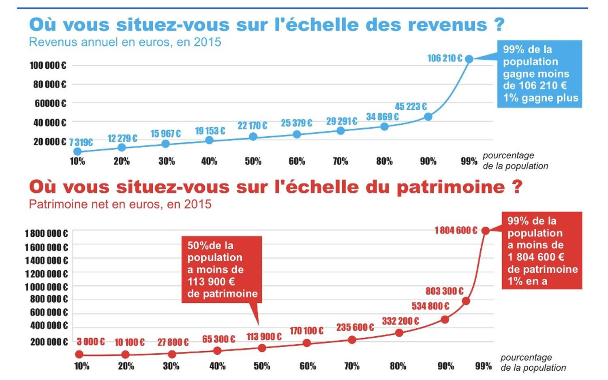

```{r setup, include=FALSE}
knitr::opts_chunk$set(echo = FALSE)

# Learn more about creating blogs with Distill at:
# https://rstudio.github.io/distill/blog.html

```
Bienvenue sur ce blog ! 

Vous trouverez ici des analyses de données sur des thèmes aussi divers que le vélo et les transports urbains, la corruption, la démographie, ou - en toute originalité - le covid 19. Ce cabinet de curiosité numérique répond, comme ceux du XIXème, d'abord à la curiosité et aux intérêts de son propriétaire.

L'idée d'un tel blog m'est apparue lors de mon apprentissage du logiciel statistique R, en parallèle de ma thèse en sociologie. D'un côté, j'ai été émerveillé - n'ayons pas peur des mots -  par les possibilités offertes par l'analyse des données pour comprendre les évolutions de notre société et, in fine, pouvoir agir en connaissance de cause. Je ne parle pas ici de modèles statistiques ultra-sophistiqués, de machine learning et autre méthode de pointe comme l'utilisation de réseau de neurones, mais bien de méthodes statistiques descriptives qui permettent de cerner les grandes dimensions d'un phénomène.  D'un autre coté, il est toujours surprenant de constater à quel point même cet usage simple des données reste rare, et comme ce potentiel est sous exploité, y compris par les professionnels les plus intéressés par des connaissances solides.

Les raisons à cela sont sans doute nombreuses : sources  de données mal connues ou identifiées, manque de formation statistique, ou encore poids des habitudes. Comment expliquer sinon la place royale réservée à la moyenne, indicateur souvent trompeur (on rapelle la plaisanterie de statisticiens : "quand Bill Gates rentre dans un bar, en moyenne tous les clients sont millionaires"). Pourquoi ne pas s'intéresser à la médiane, ou encore mieux à la distribution des fréquences, souvent bien plus éclairantes, sans être inaccesibles ?

 

Une fois mis en évidence, les résultats de l'analyse devraient idéalement être interprétés dans leur contexte pour atteindre leur plein potentiel. C'est cependant un exercice difficile à réaliser. Et pour cause, il mobilise des des informations et des outils intellectuels extérieurs, qu'ils soient issus d'une connaissance de terrain, d'une expertise professionnelle ou d'une discipline scientifique comme la sociologie. 

A sa modeste échelle et sans prétention scientifique, ce blog tentera de montrer qu'il est possible d'en apprendre beaucoup sur des sujets de société qui nous entourrent à partir de données bien employées, de méthodes statistiques simples et de quelques outils de réflexion.

Vos remarques et commentaires seront les bienvenus.

Bonne lecture !

Maxime Agator


*Sources :*

"Riche, pauvre : quel Français êtes-vous ?" La dépêche du midi, 07/06/2018. https://www.ladepeche.fr/article/2018/06/07/2812978-riche-pauvre-quel-francais-etes-vous.html 
