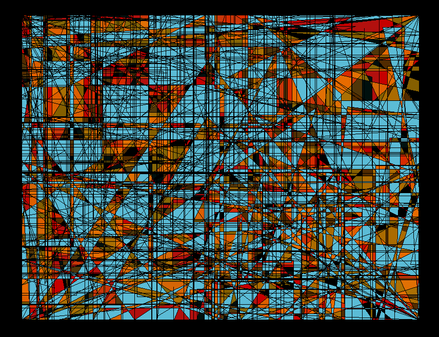

<style>
body {
text-align: justify}
</style>
```{r setup, include=FALSE}
knitr::opts_chunk$set(echo = FALSE)
```

Blog personnel d'analyses de données alimenté par Maxime Agator. 


Je réalise ici des analyses de données sur divers sujets en fonction de ma curiosité et des méthodes statistiques et data que je souhaite pratiquer.  J'utilise beaucoup le logiciel R, mais j'essaye de découvrir régulièrement d'autres outils ! 


Si les données et le code sont partagés en licence GNU GPL 3, les graphiques et textes d'analyse restent la propriété de leur auteur.

Commentaires et remarques constructives sont les bienvenues. Bonne lecture !



### English

Personal data analysis blog by Maxime Agator

You will find on this blog data anlysis of various subjects of interest to me. I pick them based on my curiosity and the data analysis tools I wish to practice. I am a R user, but I am open to others tools !

Data and codes are shared under GNU GPL 3 licence. However, graphs and and texts remain property of their author.

Feel free to share any remarks and constructive comments. Cheers !